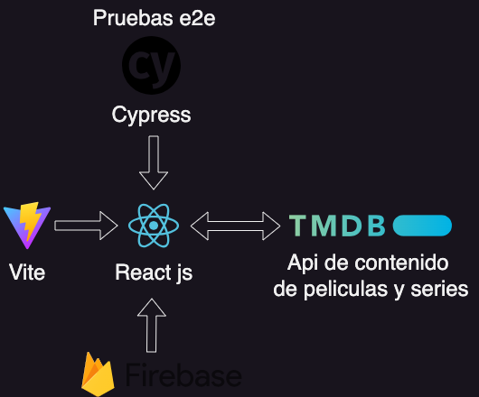

# Índice

## ejemplo of youtube del clon de netflix
https://www.youtube.com/watch?v=YQQD67N5pi0&t=9708s


## Título del Proyecto
desarrollo de un clon de netflix

## Descripción 🚀
Se realizara un ejemplo de un clon de twitter con las tecnologias: firebase, react, cypress


### Pre-requisitos 📋

Que cosas necesitas instalar

```
node 22 o nvm version 22
vite
react
firebase
themoviedb
```

## Explicación de las tecnologías
Muy brevemente sobre lo que se realiza en cada una

*[node](https://nodejs.org/en/download/package-manager)
React en el frontend y firebase para el backend en el servidor.

*[api movie](https://www.themoviedb.org/)
Api de peliculas de donde se saca las categorias de peliculas o series

*[cypress](https://www.cypress.io/)
Es el que realiza las pruebas e2e en el frontend.

## Arquitectura
imagen de representacion de la app y herramientas de VScode



## Sitio Web
https://netflix-clone-36d36.web.app

## Demostracion de app

link: https://www.youtube.com/watch?v=YOUNPUdeYTc

## Expresiones de Gratitud 🎁

* Comenta a otros sobre este proyecto 📢
* Invita una cerveza 🍺 o un café ☕ a alguien del equipo. 
* Da las gracias públicamente 🤓.


---
⌨️ con ❤️ por [fmps91](https://github.com/fmps91) 😊